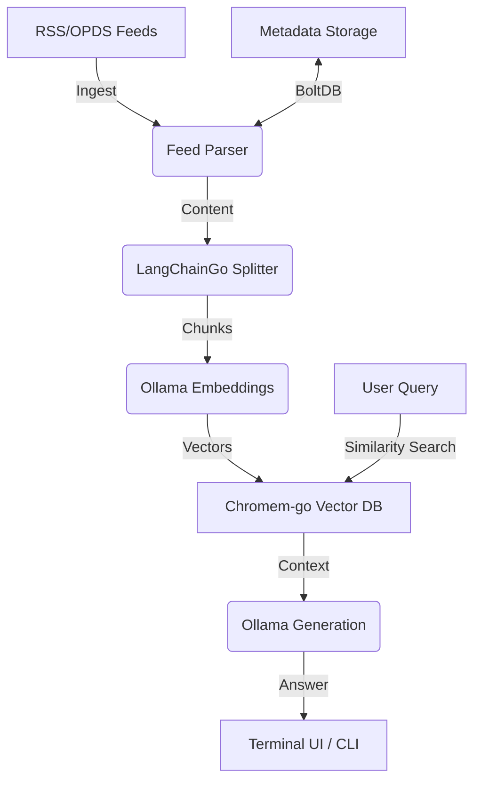

# Document Feed Embedder

[](https://github.com/eldius/document-feeder/actions/workflows/ci.yml)
[](https://go.dev/)
[](LICENSE)

A powerful Go-based Proof of Concept (POC) for building a local knowledge base using **Retrieval-Augmented Generation (RAG)**. It ingests RSS and OPDS feeds, generates embeddings using **Ollama**, stores them in a local vector database, and provides a polished CLI/TUI to query your data.

## 🚀 Key Features

-   **Feed Ingestion**: Support for standard RSS and OPDS (Open Publication Distribution System) feeds.
-   **Local Vector Database**: Uses `chromem-go` for persistent, local-first vector storage.
-   **Local LLM Integration**: Leverages **Ollama** for both embeddings and response generation.
-   **Interactive TUI**: A beautiful terminal interface built with [Bubble Tea](https://github.com/charmbracelet/bubbletea).
-   **Intelligent RAG**: Context-aware answering with similarity thresholding and document ranking.
-   **Model Benchmarking**: Compare performance and quality across different local LLMs.
-   **Observability**: Full OpenTelemetry integration (Traces, Metrics, Logs).
-   **Notifications**: XMPP-based notification system for background tasks.
-   **Weather Agent**: Built-in agent for location-aware weather updates.

## 🏗 Architecture



## 📋 Prerequisites

-   **Go**: `1.26.1` or higher.
-   **Ollama**: Running locally or accessible via network.
-   **Models**:
    -   Embedding: `nomic-embed-text` (recommended)
    -   Generation: `llama3:8b` or `deepseek-r1`

## ⚙️ Setup & Installation

1.  **Clone & Build**:
    ```bash
    git clone https://github.com/eldius/document-feeder.git
    cd document-feeder
    make release # Builds both CLI and Benchmarker
    ```

2.  **Configuration**:
    The app looks for `config.yaml` in `~/.config/`, `.`, or `~`.
    ```yaml
    ollama:
      endpoint: http://localhost:11434
      embedding:
        model: nomic-embed-text
        chunk_size: 1024
        chunk_overlap: 150
      generation:
        model: llama3:8b
        context:
          max_documents: 5
          min_similarity_score: 0.9
    telemetry:
      enabled: true
      traces:
        endpoint: "localhost:4317"
    ```

## 🛠 Usage

### CLI Commands

-   **Add a new feed**:
    ```bash
    ./document-feed-embedder feed add --feed "https://go.dev/blog/feed.atom"
    ```
-   **List all feeds**:
    ```bash
    ./document-feed-embedder feed list
    ```
-   **Ask a question (RAG)**:
    ```bash
    ./document-feed-embedder ask "What's new in Go 1.24?"
    ```
-   **Refresh content (Interactive TUI)**:
    ```bash
    ./document-feed-embedder feed refresh -i
    ```

### Model Management

-   **List downloaded Ollama models**:
    ```bash
    ./document-feed-embedder models ls
    ```

### Benchmarking

Compare different models for the same prompt to evaluate speed and accuracy:
```bash
./benchmarker --model llama3:8b --model deepseek-r1:7b --prompt "Explain Go interfaces"
```

## 📊 Observability

This project uses [OpenTelemetry](https://opentelemetry.io/). You can point it to a collector (like Jaeger or Tempo) by configuring the `telemetry` section in `config.yaml`.

## 📁 Project Structure

-   `cmd/cli/`: Main entry point for the CLI/TUI application.
-   `cmd/benchmarker/`: Utility to benchmark LLM performance.
-   `internal/adapter/`: Core RAG logic and feed orchestration.
-   `internal/persistence/`: Local storage logic (`chromem` for vectors, `storm` for metadata).
-   `internal/ui/`: Bubble Tea TUI components.
-   `scripts/`: Utilities for model conversion and environment setup.

## 🤝 Contributing

1.  Fork the project.
2.  Create your feature branch (`git checkout -b feature/AmazingFeature`).
3.  Run validation: `make validate`.
4.  Commit your changes (`git commit -m 'Add some AmazingFeature'`).
5.  Push to the branch.
6.  Open a Pull Request.

## 📜 License

Distributed under the MIT License. See `LICENSE` for more information.

---
*Built with ❤️ using Go, Ollama, and Bubble Tea.*
